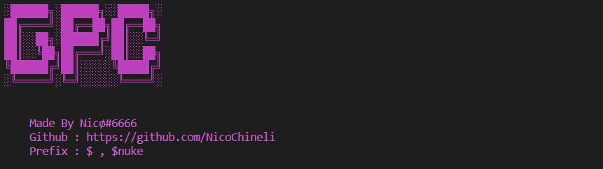

# Discord-Nuker-Python

Simple Discord Nuker Built In Python!

# Installation

### Windows

```
Download Repository / Clone Code
pip3 install requirements.txt
Run The Code
```

# Usage

Use $nuke To Nuke Channel!

# Options

1. Giving Everyone Admin
2. Deleting Every Existing Channel
3. Creating New Channels
4. Sending Messages To That Channels
5. Renaming Server
